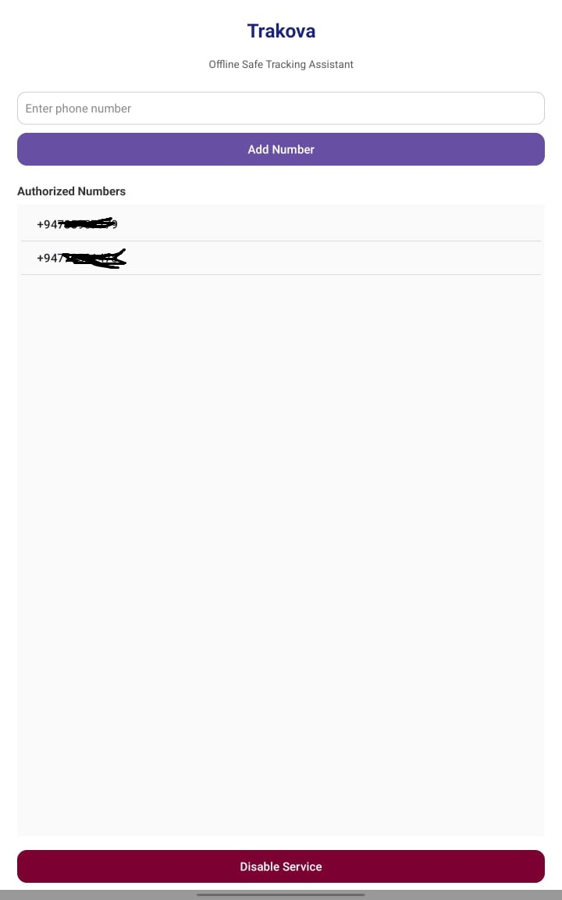
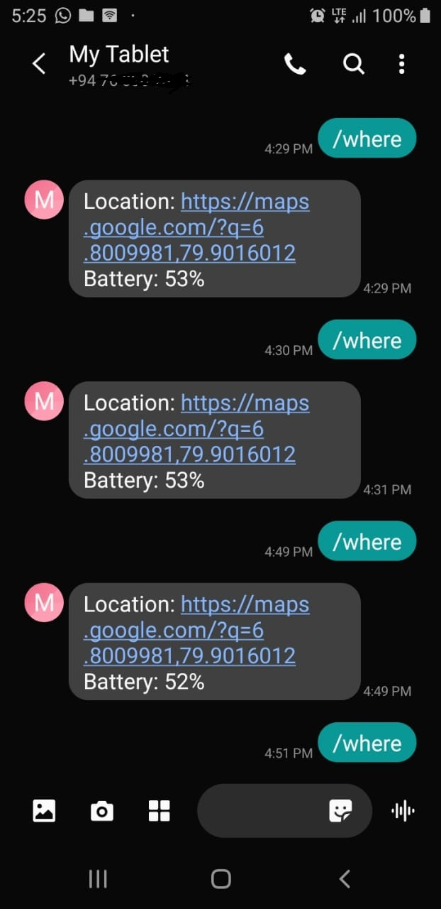

# **Trakova – Offline Location Finder App**

Trakova is a lightweight, privacy-focused **offline location finder** Android app built using **Kotlin** in **Android Studio**.
Unlike online tracking apps that rely on internet or cloud servers, Trakova works **100% via SMS**, allowing trusted contacts to find your location even in **no-internet areas**, as long as **GSM signal** exists.

---

## 🚀 **Features**

### 🔒 **Authorized Numbers Only**

Only phone numbers added inside the app can request location.

### 📡 **Offline Location via SMS**

When an authorized number sends **`/where`**, the device automatically replies with:

```
Location: https://maps.google.com/?q=<latitude>,<longitude>
Battery: <percentage>%
```

Example:

```
Location: https://maps.google.com/?q=6.8009981,79.9016012
Battery: 52%
```

### 🔋 **Battery Level Included**

Shows current battery percentage for safety and awareness.

### 🪶 **Lightweight & Efficient**

* Very small app size
* Consumes minimal background resources
* No cloud APIs, no accounts, no internet needed

### 🔐 **Privacy-First**

Everything is local — no external data transmission.

---

## 🧭 **Why Trakova?**

Most tracking apps need:
❌ Internet
❌ Cloud servers
❌ Live syncing

Trakova needs only:
✔ GSM signal
✔ SMS capability

Perfect for:

* Remote areas
* Emergency safety
* Hiking & field work
* Family monitoring (children, elders)

---

## 📱 **How It Works**

1. Install Trakova
2. Add authorized numbers
3. Enable the background service
4. From a trusted number, send:

   ```
   /where
   ```
5. You receive:

   * Google Maps link
   * Battery level

---

## 📸 **App Screenshot**



---

## 💬 **Message View Example**



---

## 🔧 **Tech Stack**

* Kotlin
* Android Studio
* FusedLocationProviderClient
* SMSManager
* Foreground Service
* Notification Channel (Android 8+)

---

## ⚠️ **Permissions Required**

| Permission             | Purpose                                       |
| ---------------------- | --------------------------------------------- |
| `SEND_SMS`             | Send automatic location replies               |
| `RECEIVE_SMS`          | Detect incoming `/where` command              |
| `ACCESS_FINE_LOCATION` | Fetch GPS coordinates                         |
| `FOREGROUND_SERVICE`   | Keep background SMS listener active           |
| `POST_NOTIFICATIONS`   | Required on Android 13+ to show notifications |
| `READ_PHONE_STATE`     | (Optional) SIM-related operations             |

---

## 🛡️ **Privacy Notes**

* No online storage
* No analytics
* No remote servers
* Only trusted contacts can request location
